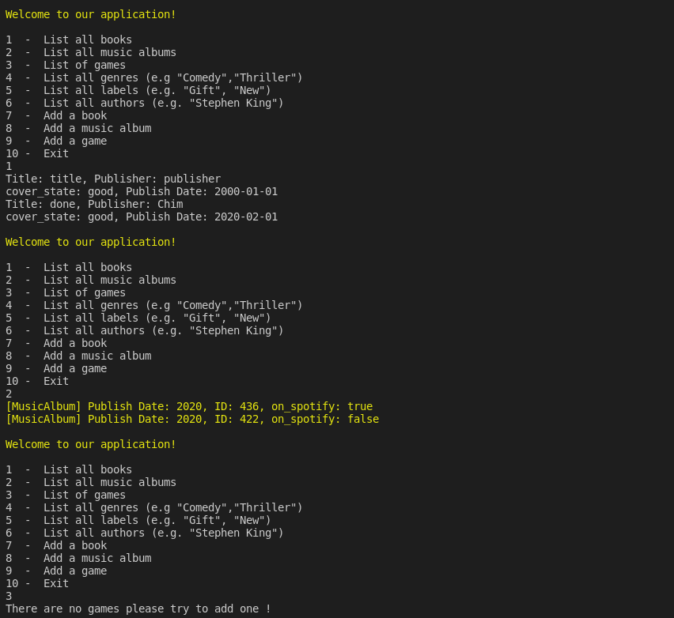

# CATALOG OF MY THINGS

> iNFOR COMING SOON

## Project screenshots



Additional description about the project and its features.

## Built With

- RUBY

## Gems Used

- Rubocop
- Colorize

## How to Setup

> You can simply clone or download [this repository](https://github.com/Chimwemwe-127001/catalog_of_my_things.git), and use your favorite browser or code editor to run this program.

- To open the project after download, simply double click the index.html file

- To open this project using vs code ( for this example) or your favorite code editor, you can follow the guide below:
  > in your cmd or command line navigate to where this project is located, then;

```cmd
cd catalog_of_my_things
```

> thereafter run

```cmd
code .
```

## How to Run the App through terminal

- To run the application through trminal, make sure ruby and IRB is installed in your computer then follow the guide below:
  > in your cmd or command line navigate to where this project is located, then;

```cmd
cd catalog_of_my_things
```

## Install Gems


```cmd
bundle install
```
```cmd
gem install colorize
```

> thereafter run

```cmd
./main.rb
```

## Author

👤 **Mongare S.**

- GitHub: [@githubhandle](https://github.com/Mosams/)
- Twitter: [@twitterhandle](https://twitter.com/sam_mongare)
- LinkedIn: [LinkedIn](https://www.linkedin.com/in/sammy-mongare-b8288310b/)

## 🤝 Contributing

Contributions, issues, and feature requests are welcome!

Feel free to check the [issues page](../../issues/).

## Show your support

Give a ⭐️ if you like this project!

## Acknowledgments

- Microverse Team for facilitating project requirements and resources

## 📝 License

This project is [MIT](./MIT.md) licensed.